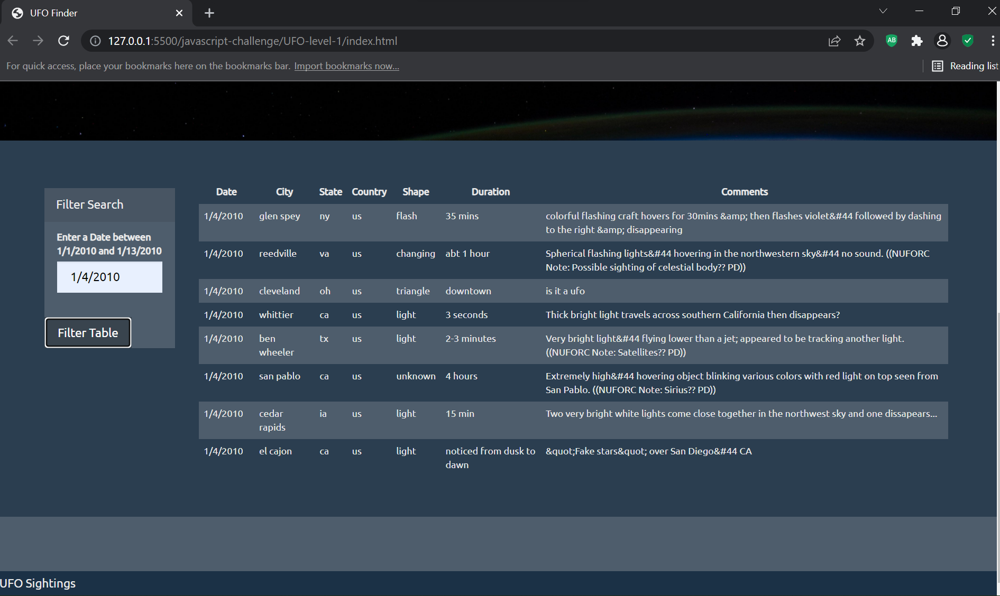

# javascript-challenge

 The extra-terrestrial menace has come to Earth and we here at `ALIENS-R-REAL` have collected all of the eye-witness reports we could to prove it! All we need to do now is put this information online for the world to see and then the matter will finally be put to rest.

There is just one tiny problem though... our collection is too large to search through manually. Even our most dedicated followers are complaining that they are having trouble locating specific reports in this mess.

 This code will create a table dynamically based upon a dataset. It also allows our users to filter the table data for specific values. We use pure JavaScript, HTML, and CSS, and D3.js on our web pages. They are the only coding languages which can be trusted.

The planet Earth needs to know what we have found!

Using JavaScript, HTML, and CSS, and D3.js created a table dynamically on a web page.

The first app listens for events and searches through the `datetime` column to find rows that match user input. The code can be found by clicking: [UFO-level-1](UFO-level-1/index.html)

The second app, uses multiple `input` tags, where the user can set all 5 multiple filters and search for UFO sightings click link [UFO-level-2](UFO-level-2/index.html).The following table columns are searched:
  1. `datetime`
  2. `city`
  3. `state`
  4. `country`
  5. `shape`

  